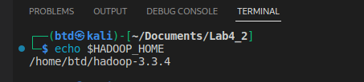
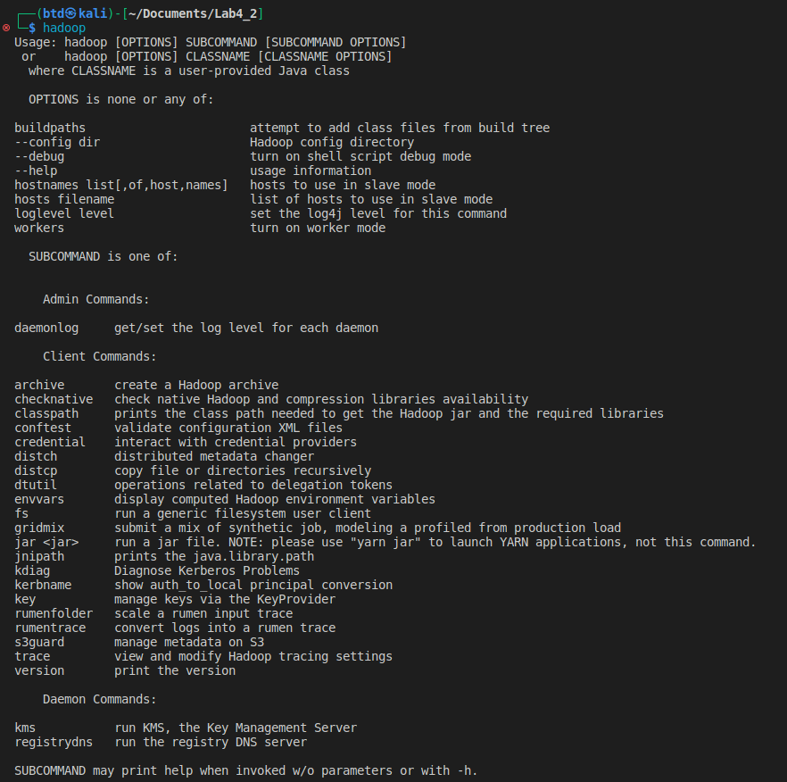
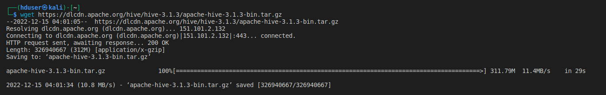
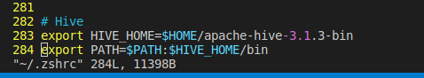
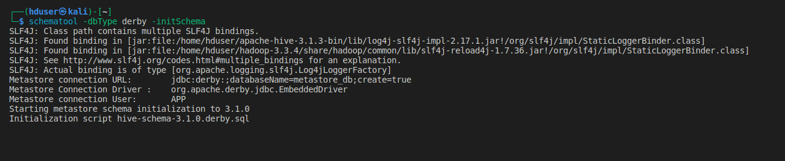
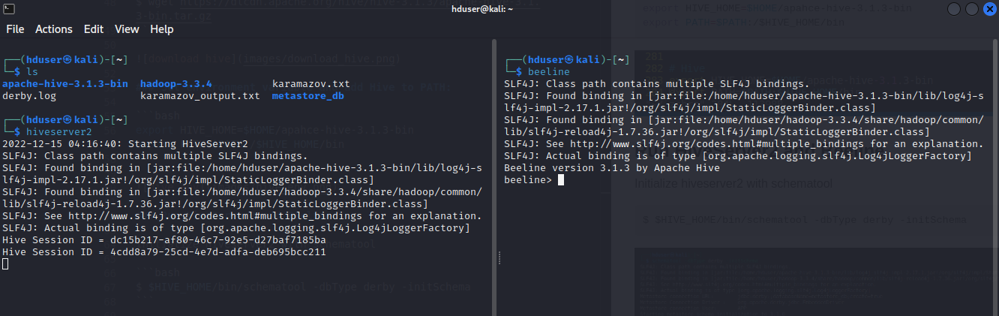
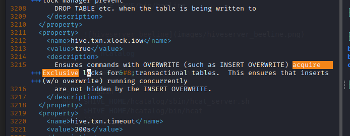
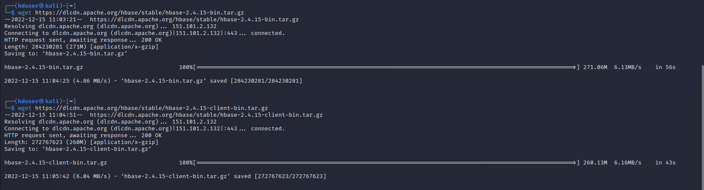

Lab 4-2: HBase, Hive, Pig
---

CIS 612, Fall 2022

Name: Bradley Dowling
CSU ID: 2657649

# Setup

- Applications to set up:
    1. Hadoop
    2. Hive
    3. HBase
    4. Hive

## Hadoop

Hadoop is mostly set up from the previous lab.

```bash
$ echo $HADOOP_HOME
``` 




```bash
$ hadoop
```



We need to create some directories for Hive:

```bash
$ hadoop fs -mkdir /tmp
$ hadoop fs -mkdir -p /user/hive/warehouse
$ hadoop fs -chmod g+w /tmp
$ hadoop fs -chmod g+w /user/hive/warehouse
```

## Hive

### Download current version of Hive (3.1.3)

```bash
$ wget https://dlcdn.apache.org/hive/hive-3.1.3/apache-hive-3.1.3-bin.tar.gz
```



### Set environment variable and add Hive to PATH:

```bash
export HIVE_HOME=$HOME/apahce-hive-3.1.3-bin
export PATH=$PATH:/$HIVE_HOME/bin
```



### Run HiveServer2 and Beeline

Initialize hiveserver2 with schematool

```bash
$ $HIVE_HOME/bin/schematool -dbType derby -initSchema
```



Run hiveserver2:

```bash
$ $HIVE_HOME/bin/hiveserver2
$ $HIVE_HOME/bin/beeline
```



### HCatalog

Run HCatalog server and hcat

```bash
$HIVE_HOME/hcatalog/sbin/hcat_server.sh
$HIVE_HOME/hcatalog/bin/hcat
```


### Fixing an error:

There is an illegal character in hive-site.xml on line 3215. It is in the distribution and must be corrected by the user. 



### Other Issues:

The current versions of Hive documentation are not up to date with the current versions of Hive and there are errors in the actual Apache stable distribution. I was unable to correctly connect even to the simple derby DB for the metadata repository for Hive itself. 

- illegal characters in configuration file
- configuration script hive-config.sh invalid bash syntax


## HBase

### Download HBase

```bash
$ wget https://dlcdn.apache.org/hbase/stable/hbase-2.4.15-bin.tar.gz
$ wget https://dlcdn.apache.org/hbase/stable/hbase-2.4.15-client-bin.tar.gz
```



